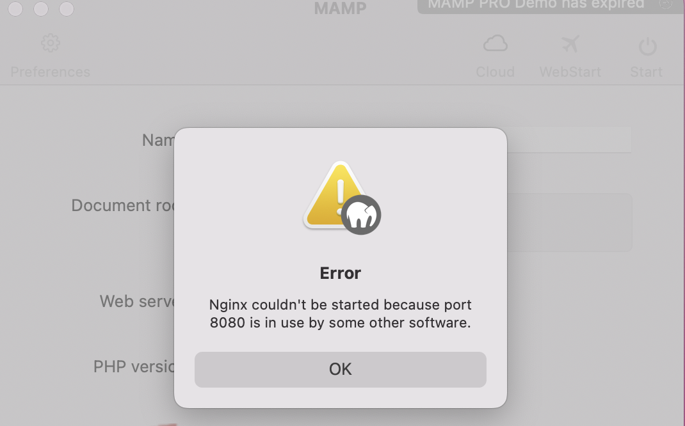

# 8080 포트를 이미 다른 곳에서 사용하고 있는 경우
MAMP가 켜져있었는데 갑자기 꺼졌다. 그래서 다시 구동시킬려고 하니까 8080 포트를 이미 다른 곳에서 사용하고 있다고 에러 메시지가 떴다.



## 원인
- 8080 포트를 다른 곳에서 사용하고 있는지 확인해 본 결과 nginx 였다.
- 이미 nginx에서 사용중이기 때문에 MAMP가 구동이 되지 않았다.


## 해결
1. `lsof` 명령어를 사용해서 8080 포트를 사용하고 있는 프로세스를 확인했다.
2. 사용하는 곳을 파악하고, 해당 프로세스를 죽였다.
    ```bash
    $ kill 76262
    ```
3. 그 이후 MAMP start 버튼을 누르니 잘 구동됐다.
