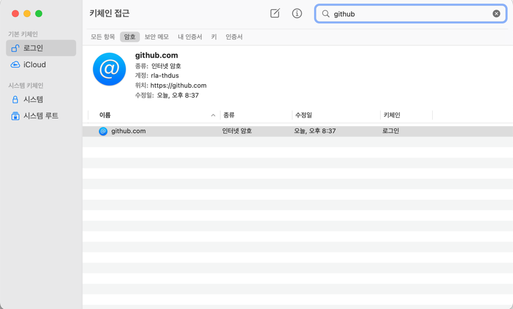
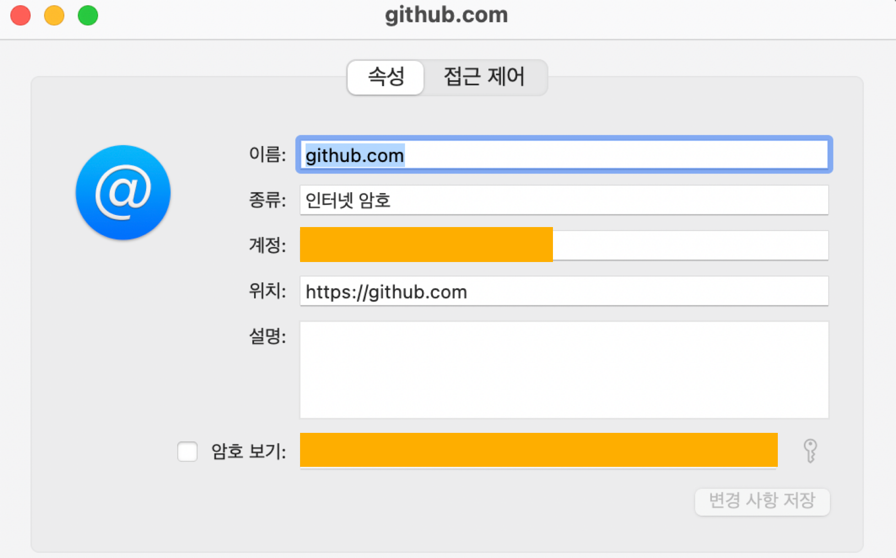
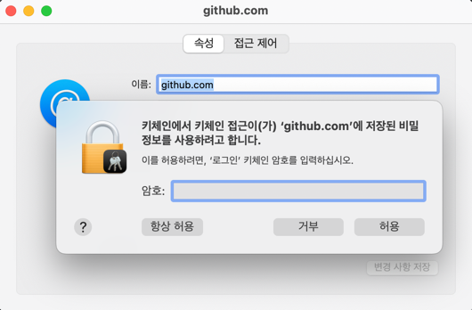

# Permission to A denied to B
내 개인 컴퓨터에서 `git push` 를 하려고 하는데 keychain이 회사 계정으로 되어있어서 permission 에러가 떴다.

## 원인
내가 올리고 싶은 저장소는 내 개인 저장소인데 회사의 계정이 연결되어 있어서 발생하게 됐다. 회사 맥과 같은 애플 아이디를 사용하면서 iCould에 저장된 keychain이 공유가 된 것 같다.

```
git push origin main
remote: Permission to 개인 계정/저장소 denied to 회사 계정.
fatal: unable to access 'https://github.com/rla-thdus/dev-tips.git/': The requested URL returned error: 403
```

## 해결
### 1. 키체인 접근에서 github 찾기


- 키체인 접근에 들어가서 우측 상단에 검색할 수 있는 곳에 github 라고 입력한다.

### 2. github 계정 작성하기

- 노란 박스가 있는 부분을 자신의 github 계정에 맞게 넣어주면 된다.

### 2-1. 자신의 노트북 비밀번호를 입력해야 한다

- 2번을 하면서 암호를 변경하기 위해 암호 보기의 체크 박스를 눌렀을 때 위의 사진처럼 암호를 입력하라는 대화상자가 나타나는데 여기에 깃허브 비밀정보가 아닌 자신의 컴퓨터의 비밀번호를 입력해야 한다.
- ~~나도 내 계정 비밀 번호 입력하는 바보짓 함~~

---

[^1] https://docs.github.com/en/get-started/getting-started-with-git/updating-credentials-from-the-macos-keychain